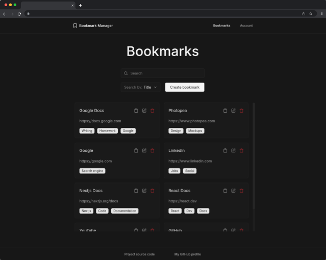

## Bookmark Manager

[Live Demo](https://google.com)

Bookmark Manager is a streamlined link management web app built with Next.js, React, Supabase, TypeScript and TailwindCSS, featuring user authentication, account management and full CRUD functionality for organising bookmarks

### 📋 Features

- User login and signup with email confirmation
- Account management: change password, logout, delete account, delete all bookmarks
- Create, edit and delete bookmarks
- Display bookmarks as cards with copy link, edit and delete controls
- Add or remove tags on bookmark cards
- Search and filter bookmarks
- Bookmarks persist across devices for each user
- Bookmarks cached in the browser for faster loading
- Fully responsive design for desktop and mobile

### 🖼️ Preview

[View Live App](https://google.com)

### 🛠️ Built With

  
  
  
  

